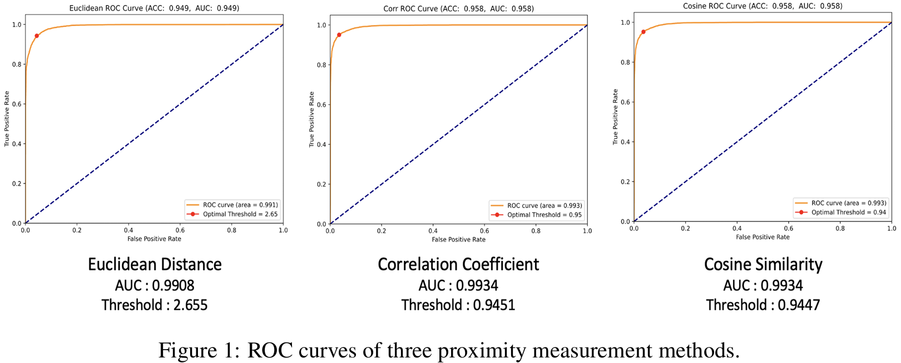
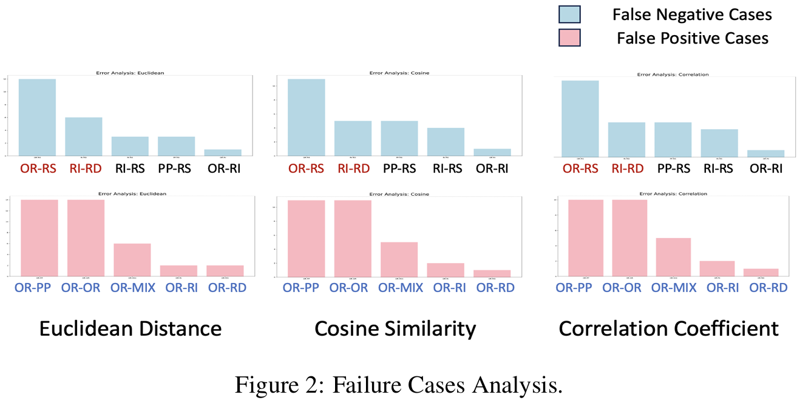

# Plagiarism Detection with BERT

This project detects plagiarism in academic abstracts using proximity-based metrics and a fine-tuned BERT model for enhanced accuracy. A dataset of 12,600 pairs, generated through text augmentation, enables robust evaluation of these methods. The analysis highlights the strengths and limitations of proximity metrics and BERT in plagiarism detection.

## Features
- **Web Crawling**: Automated data collection from Google Scholar
- **Data Augmentation**: EDA and Parrot paraphraser
- **BERT Classification**: Fine-tuned BERT for improved accuracy
- **Threshold Optimization**: ROC-based threshold selection for proximity methods
- **Proximity Measures**: Cosine Similarity, Euclidean Distance, Correlation Coefficient

---
## Results

### Visual Results
#### 1. ROC Curves
<p align="center">
  
</p>

#### 2. Analysis Overview
<p align="center">
  
</p>

---
## Installation
1. Clone the repository:
   ```bash
   git clone <repository-url>
   cd <repository-folder>
   ```

2. Download the BERT model:
   ```bash
    python -m transformers.cli download bert-base-uncased
   ```

## Usage
Data Crawling
   ```bash
    python crawling_selenium.py
   ```

Train the BERT Model
   ```bash
    python PDBert.py --mode train --data_dir ./data --output_dir ./output

   ```

Threshold Optimization
   ```bash
    python get_threshold.py
   ```
